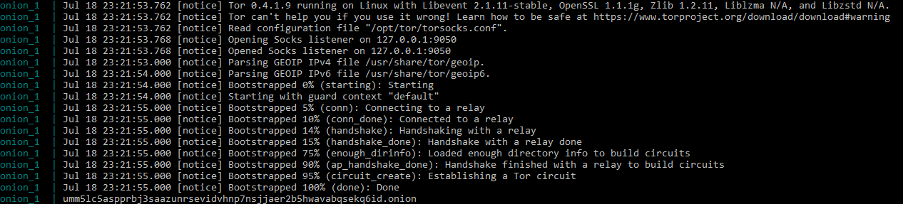

# docker-tor-hiddenservice

## Usage
Adjust the Dockerfile/data in the `web` directory to your needs.
Deploy the the service using `docker-compose up` your .onion address will be printed to your console.

## Features
- Tor service and webserver are sperated.
- The webserver can not access the internet.
